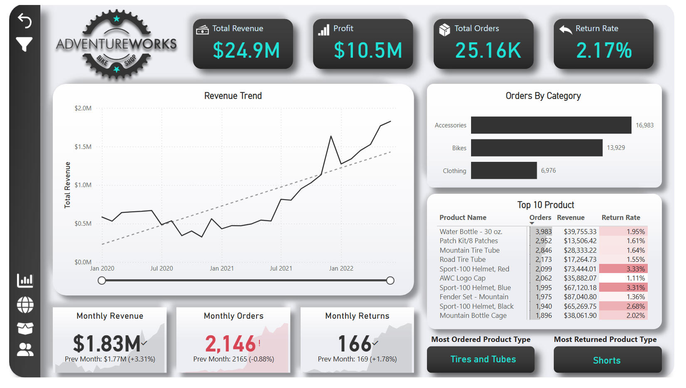
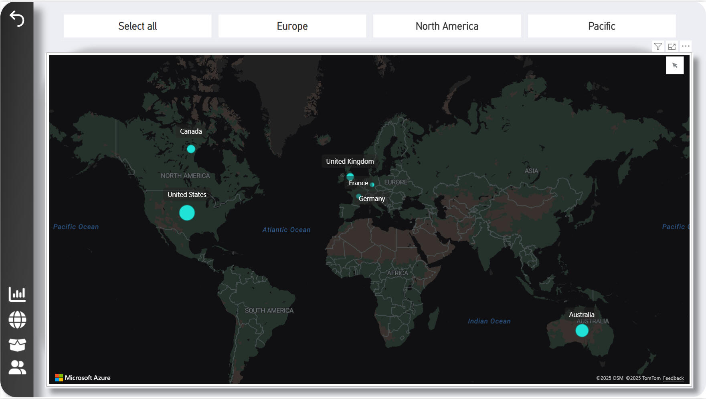
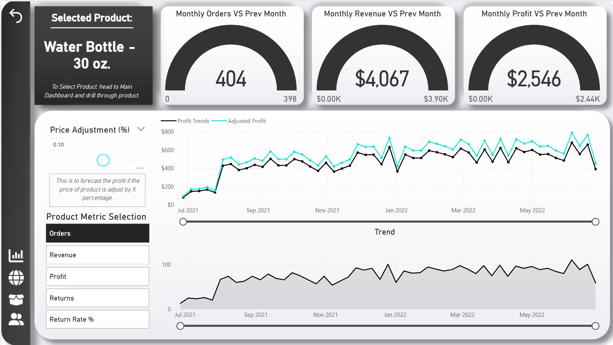
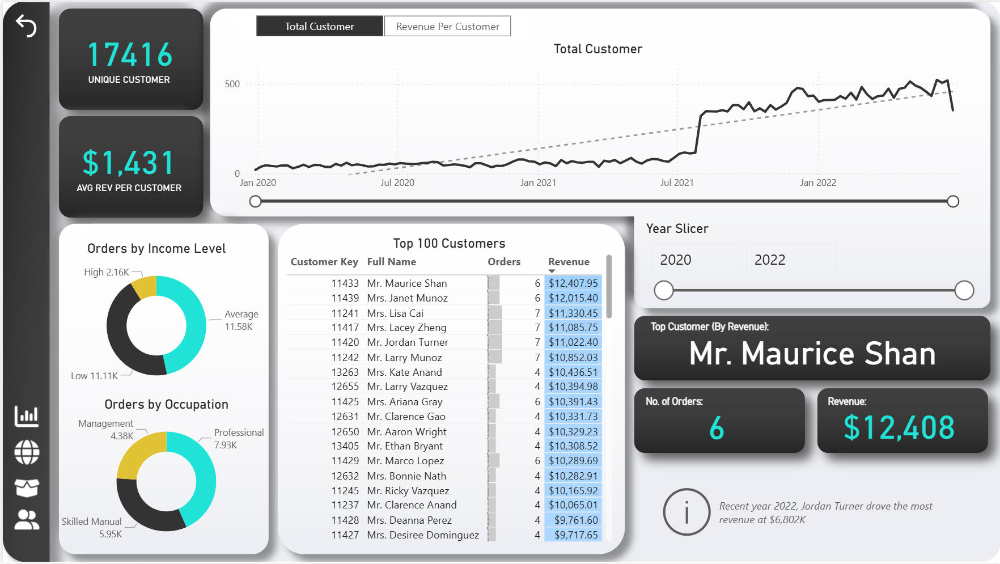
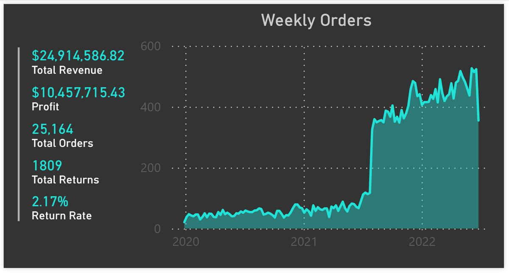

# 📊 Adventure Works — Bike Shop Analysis

**Author:** Humendra Pun  
**Date:** 2022  
**Tools:** Power BI · DAX · Data Modelling · What-if Parameters

---

## Overview

End-to-end interactive Power BI dashboard for Adventure Works Bike Shop, analysing sales performance, product trends, and customer behaviour from **January 2020 to May 2022** across North America, Europe, and the Pacific.

**Dataset:** Sales, product, and customer tables with star-schema relational model  
**Time range:** Jan 2020 – May 2022  
**Scope:** 4 dashboard pages · 17,416 unique customers · 3 product categories

---

## Results at a Glance

| Metric | Value |
|--------|-------|
| Total Revenue | **$24,914,586.82** |
| Total Profit | **$10,457,715.43** |
| Total Orders | **25,164** |
| Total Returns | **1,809** |
| Return Rate | **2.17%** (low) |
| Unique Customers | **17,416** |
| Avg Revenue per Customer | **$1,431** |
| Monthly Revenue (latest) | **$1.83M** (+3.31% MoM) |

---

## Project Structure

```
├── Adventure Works - Bike Shop.pbix   # Full interactive dashboard
├── images/
│   ├── dashboard/
│   │   ├── main_dashboard.png         # KPIs, revenue trend, top products
│   │   ├── map_view.png               # Geographic order distribution
│   │   ├── product_detail.png         # Product drill-down + what-if pricing
│   │   └── customer_detail.png        # Customer segmentation + top performers
│   └── data-model/
│       └── data_model.png             # Star schema relationship diagram
└── README.md
```

---

## Dashboard Pages

### 📈 Main Dashboard
High-level KPIs with month-over-month comparison cards, revenue trend line chart (2020–2022), orders-by-category breakdown, and a top 10 products table with custom tooltip.



---

### 🌍 Map View
Filled map visual showing geographic distribution of orders. Region slicers (Europe / North America / Pacific) for interactive filtering. Key markets: US, Canada, UK, France, Germany, Australia.



---

### 🔍 Product Detail
Single-product drill-down with:
- Gauge visuals for monthly orders, revenue, and profit vs. targets
- Revenue and profit trend line charts
- **What-if parameter** — price adjustment slider → real-time adjusted profit forecast



---

### 👥 Customer Detail
17,416 unique customers — segmented by income level and occupation (donut charts), revenue-per-customer trend, and top 100 customers ranked by revenue with year slicer.



---

### 📅 Weekly Orders Overview
Full weekly orders trend 2020 → 2022 showing growth trajectory. Exact KPI totals: $24,914,586.82 revenue · $10,457,715.43 profit · 25,164 orders · 1,809 returns.



---

## Key Findings

1. **Accessories dominate by volume** — 16,983 orders vs. Bikes (13,929) and Clothing (6,976); accessories drive repeat purchases
2. **Bikes dominate by revenue** — higher unit value makes bikes the primary revenue driver despite fewer orders
3. **2.17% return rate** — exceptionally low, indicating product quality and customer fit
4. **Top product by orders: Water Bottle - 30 oz.** — 3,983 orders, $39,755 revenue
5. **Tires and Tubes** — highest-volume sub-category overall
6. **Shorts** — highest return rate sub-category, worth investigating sizing/quality
7. **Revenue trending up** — consistent growth 2020 → 2022; latest month $1.83M (+3.31% MoM)
8. **Geographic concentration** — strongest markets in US, UK, and Australia
9. **Top customer: Mr. Maurice Shan** — $12,408 revenue from 6 orders ($2,068 avg order value)
10. **Average-income professionals** order most — majority of customer base by segment

---

## Business Recommendations

| Priority | Recommendation |
|----------|---------------|
| 🔴 High | Cross-sell accessories at point of bike purchase — accessories drive volume, bundles drive value |
| 🔴 High | Investigate Shorts return rate — reduce returns with better sizing guides or quality review |
| 🟡 Medium | Develop loyalty programme targeting top customers (Mr. Maurice Shan tier) |
| 🟡 Medium | Expand marketing in UK and Australia — strong existing base, growth potential |
| 🟡 Medium | Use What-if price modelling to test 5–10% price increase on top-margin products |
| 🟢 Low | Add forecasting visuals for 2023 revenue targets based on 2020–2022 trend |

---

## Technical Implementation

| Feature | Details |
|---------|---------|
| Data Modelling | Star schema — Sales fact table + 5 dimension tables |
| DAX Measures | Total Revenue, Profit, Orders, Return Rate, Avg Revenue/Customer, MoM % change |
| What-if Params | Price adjustment slider → dynamic revenue forecast on Product Detail page |
| Interactivity | Cross-page slicers (year, region, product), custom bar chart tooltip |
| Visuals | Cards, KPI cards, line charts, bar charts, filled map, pie charts, tables, gauges |

---

## How to Use

1. Open `Adventure Works - Bike Shop.pbix` in **Power BI Desktop**
2. Start on **Main Dashboard** — apply year/region filters for high-level view
3. Switch to **Map** — explore geographic concentration of orders
4. Go to **Product Detail** — select any product, adjust price slider for revenue forecast
5. Go to **Customer Detail** — filter by year, explore income/occupation segments

---

## Tech Stack

| Tool | Purpose |
|------|---------|
| `Power BI Desktop` | Dashboard development and data modelling |
| `DAX` | Calculated measures, KPIs, MoM comparisons |
| `What-if Parameters` | Interactive price forecasting |
| `Power Query` | Data transformation and loading |
